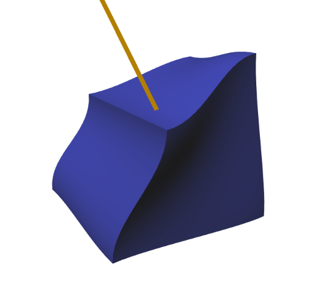
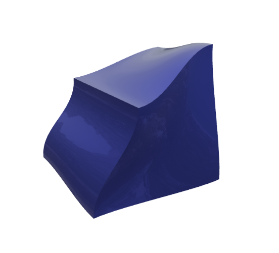
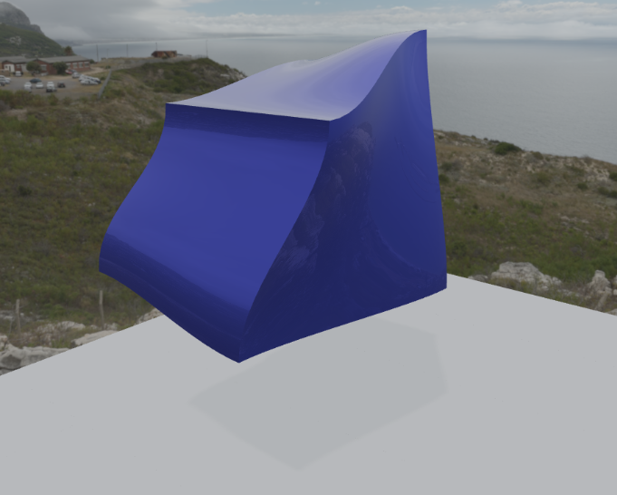
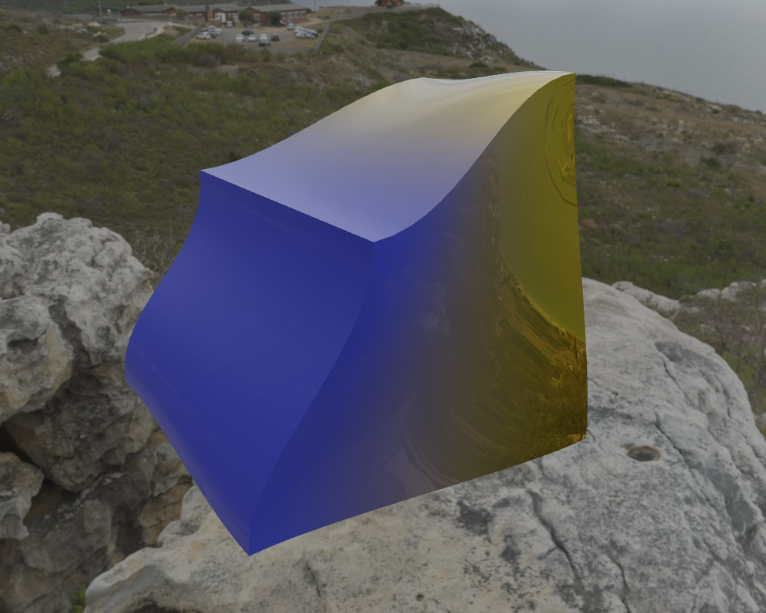
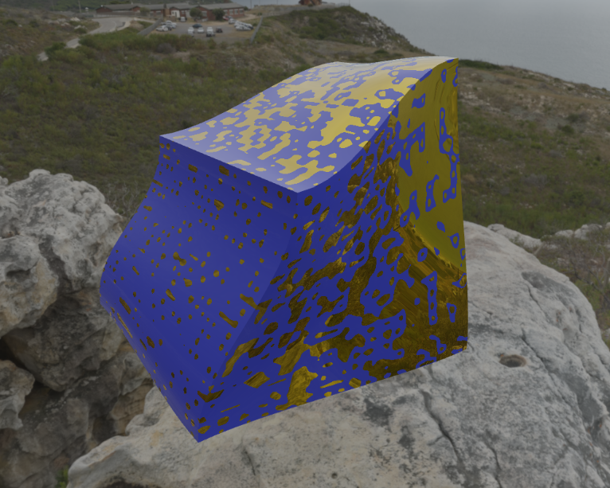
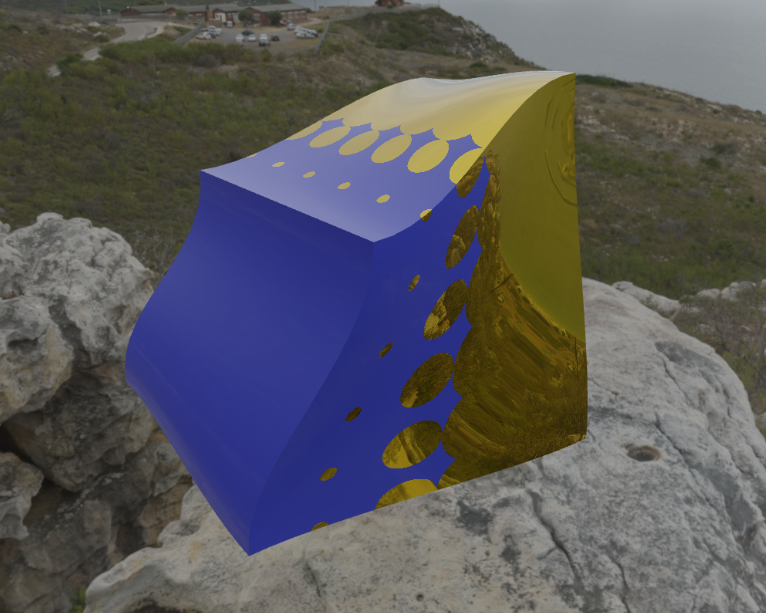

# Realistic hyperpatch visualization

## English

This repository contains the source code of my Master's Thesis. The goal of the project is to improve the realistic visualization of 3D models composed of heterogeneous solids defined through hyperpatches. To achieve this, the project builds upon an existing application developed by [Alberto Elorza Rubio](https://hdl.handle.net/10953.1/23974), into which advanced lighting techniques are integrated through shader programming. A study of the state of the art in lighting and realistic rendering techniques has been conducted, and physically based rendering methods used in [Unreal Engine 4](https://cdn2.unrealengine.com/Resources/files/2013SiggraphPresentationsNotes-26915738.pdf) have been selected and implemented. The result is a significant improvement in the visual representation of heterogeneous materials, while maintaining the tool’s efficiency and cross-platform compatibility.


### Results

|  |  |  |
|:--:|:--:|:--:|
| Original lighting | PBR + IBL | PBR + IBL + Skybox + Shadow |

|  |  |  |
|:--:|:--:|:--:|
| Continuous material | Functionally graded material | Composite material |

### Compilation

#### Prerequisites

- [CMake](https://cmake.org/download/) >= 3.5
- [Conan](https://conan.io/downloads.html) >= 2.0
- A compatible C++ compiler (e.g., gcc, clang, MSVC)

#### Linux

To build the project on Linux, follow these steps:

1. Clone the repository:
   ```bash
    git clone https://github.com/hatz2/heterogeneous-solids.git
    cd heterogeneous-solids
    ```

2. Create a build directory:
    ```bash
    mkdir build
    cd build
    ```

3. Install dependencies with Conan:
    ```bash
    conan install .. --build=missing
    ```

4. Configure the project with CMake:
    ```bash
    cmake .. -DCMAKE_TOOLCHAIN_FILE=./Release/generators/conan_toolchain.cmake -DCMAKE_BUILD_TYPE=Release
    ```

5. Copy shaders and ImGui configuration files:
    ```bash
    cp -r ../resources/ .
    cp ../imgui.ini  .
    ```

6. Build the project:
    ```bash
    make
    ```

7. Run the application:
    ```bash
    ./heterogeneous_solids
    ```

#### Windows


## Español

Este repositorio contiene el código fuente de mi Trabajo de Fin de Máster. El objetivo del trabajo es mejorar la visualización realista de modelos 3D formados por sólidos heterogéneos definidos mediante hiperparches. Para ello, se parte de una aplicación existente desarrollada por [Alberto Elorza Rubio](https://hdl.handle.net/10953.1/23974), a la que se integran técnicas avanzadas de iluminación mediante la programación de shaders. Se ha realizado un estudio del estado del arte en técnicas de iluminación y renderizado realista; se han seleccionado e implementado los métodos de renderizado basado en la fı́sica de la luz utilizados en [Unreal Engine 4](https://cdn2.unrealengine.com/Resources/files/2013SiggraphPresentationsNotes-26915738.pdf). El resultado es una mejora significativa en la representación visual de materiales heterogéneos, conservando la eficiencia y compatibilidad multiplataforma de la herramienta.

### Resultados

|  |  |  |
|:--:|:--:|:--:|
| Iluminación original | PBR + IBL | PBR + IBL + Skybox + Sombras |

|  |  |  |
|:--:|:--:|:--:|
| Material continuo | Material funcionalmente graduado | Material compeusto |


### Compilación

#### Requisitos previos

- [CMake](https://cmake.org/download/) >= 3.5
- [Conan](https://conan.io/downloads.html) >= 2.0
- Un compilador C++ compatible (por ejemplo: gcc, clang, MSVC)

#### Linux

Para compilar el proyecto en Linux, sigue estos pasos:

1. Clona el repositorio:
   ```bash
    git clone https://github.com/hatz2/heterogeneous-solids.git
    cd heterogeneous-solids
    ```

2. Crea un directorio donde compilar:
    ```bash
    mkdir build
    cd build
    ```

3. Instala las dependencias con Conan:
    ```bash
    conan install .. --build=missing
    ```

4. Configura el proyecto con CMake:
    ```bash
    cmake .. -DCMAKE_TOOLCHAIN_FILE=./Release/generators/conan_toolchain.cmake -DCMAKE_BUILD_TYPE=Release
    ```

5. Copiar archivos de shaders y de configuración de ImGui:
    ```bash
    cp -r ../resources/ .
    cp ../imgui.ini  .
    ```

6. Compilar el proyecto:
    ```bash
    make
    ```

7. Ejecutar la aplicación:
    ```bash
    ./heterogeneous_solids
    ```

#### Windows